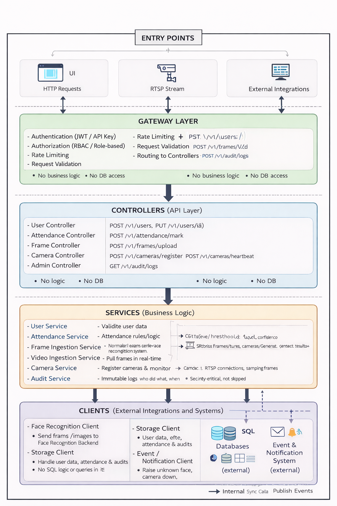

# Backend API system

### Mental model
```
ENTRY POINTS
   ↓
Gateway
   ↓
Controllers
   ↓
Services (Business Logic)
   ↓
Clients (External Communication)
   ↓
External Systems
```



### 1️⃣ Backend API — Responsibility (LLD definition)
What this system is responsible for
- Single entry point for all external clients
- Enforces security, contracts, and rules
- Orchestrates calls to internal systems
- NEVER does heavy ML work

### 2️⃣ Backend API — Internal Components (LLD)
```
Backend API System
│
├── API Gateway Layer
│   ├── Authentication
│   ├── Authorization (RBAC)
│   ├── Rate Limiting
│   ├── Request Validation
│   └── Request Routing
│
├── API Controllers (HTTP Layer)
│   ├── User APIs
│   ├── Image / Frame APIs
│   ├── Video / Stream APIs
│   └── Admin / System APIs
│
├── Application Services (Business Logic)
│   ├── User Service
│   ├── Attendance Service
│   ├── Frame Ingestion Service
│   ├── Camera Management Service
│   └── Audit & Logging Service
│
├── Integration Layer
│   ├── Face Recognition Backend Client
│   ├── Storage Access Client
│   └── Event/Notification Client
│
└── Cross-Cutting
    ├── Error Handling
    ├── Structured Logging
    ├── Metrics & Tracing
    └── Config Management
```

### 3️⃣ API Gateway Layer (LLD)
#### 🔐 Authentication
- JWT / API key
- Token validation
- Reject unauthenticated requests
#### 🛂 Authorization
- Role-based access (Admin / User / Camera)
- Example:
    - UI user → attendance APIs
    - Camera → frame ingestion only
#### 🚦 Rate Limiter
- Prevent abuse
- Per-user / per-camera limits
#### 🧾 Request Validation
- Schema validation (image, metadata)
- Reject corrupted or malformed input
    - This is where “corrupted images” are handled
#### 🔀 Routing
- Routes request to correct controller
- No business logic here

### 4️⃣ API Controllers (HTTP Layer)
Controllers are thin.  
They only:
- Accept HTTP request
- Call service
- Return response

Examples
```
POST /v1/users
POST /v1/attendance/mark
POST /v1/Image/upload
GET  /v1/audit/logs
```
Controllers do not:
- talk to DB directly
- call models
- implement logic

### 5️⃣ Application Services (Core Logic)
🧍 User Service
- Create/update users
- Link user ↔ face data
- Validate user lifecycle  

🕒 Attendance Service
- Apply attendance rules
- Handle duplicate detection
- Apply confidence thresholds
- Decide mark / don’t mark  

📷 Frame Ingestion Service
- Accept images from UI/cameras
- Normalize metadata
- Forward frame to Face Recognition backend

🎥 Camera Management Service
- Register cameras
- Camera health tracking
- Detect camera down events

📜 Audit & Logging Service
- Record who did what and when
- Security-critical

### 6️⃣ Integration Layer (Very Important)
Backend API never talks directly to internals.  
Instead, it uses clients/adapters.  

🔗 Face Recognition Backend Client
- Sends image/frame
- Receives:
    - person_id / unknown
    - confidence score

🗄️ Storage Client
- SQL writes (users, attendance, audits)
- No business logic here

🔔 Event Client
- Emits:
    - unknown face
    - camera down
    - system anomaly
- This layer makes services:
    - testable
    - replaceable
    - scalable