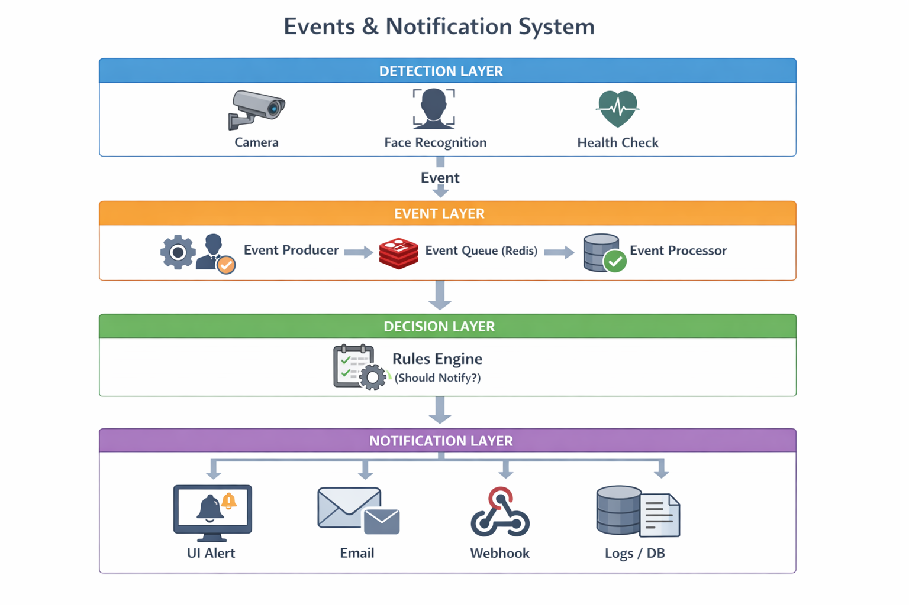

# 📄 Events & Notification System

## Goal

Notify relevant stakeholders when important events occur in the Face Recognition system (unknown face, camera failure, system error) in a **decoupled and scalable** way.

---

## Core Idea

* **Events** = something happened
* **Notifications** = who should know & how
* Detection logic must not be coupled to notification logic.

---

## High-Level Flow

```
Producer → Event Queue → Processor → Rules → Dispatcher → Channel
```
---



---
## Events

Immutable facts emitted by system components.

**Examples**

* UNKNOWN_FACE_DETECTED
* CAMERA_OFFLINE
* LOW_CONFIDENCE_MATCH

Event contains:

* type
* timestamp
* source (camera/service)
* minimal metadata

---

## Producers

* Face Recognition Service
* Camera Service
* Health Monitor

Producers only emit events, never send notifications.

---

## Rules

Decide **if**, **who**, and **how** to notify.

Example:

```
IF unknown face AND confidence < threshold
→ notify security (UI + email)
```

Rules are configurable, not hardcoded.

---

## Notifications

Actions triggered by rules:

* UI alert (WebSocket)
* Email
* Webhook
* Log entry

Failures are retried; events are never lost.

---

## Storage

* **Events**: audit trail
* **Notifications**: status & retries

---

## Tech Stack

* FastAPI
* Redis (event queue)
* PostgreSQL
* WebSockets / SMTP

---

## Key Benefits

* UI optional
* Scales independently
* Easy to add new events or channels
* Production-safe

---

## One-line Summary

> **Events say what happened, rules decide what matters, notifications decide how to tell.**

