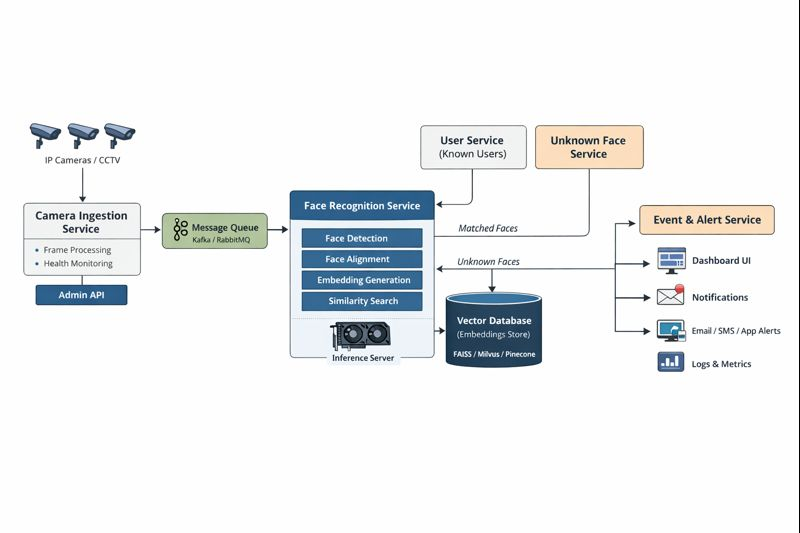

# Face recognition service



### 1️⃣ Face Recognition Service – Core Responsibility

#### Input
* Image OR video frame
* camera_id
* timestamp
* optional metadata (location, confidence threshold)

#### Output
* **recognized_user_id** OR `UNKNOWN`
* similarity score(s)
* decision confidence
* audit metadata

---

### 2️⃣ Internal Pipeline (Step-by-step)

#### Step 1: Face Detection
* Detect face(s) in the frame
* Reject:
  * blurred faces
  * too small faces
  * corrupted images

👉 Output: cropped face(s)

---

#### Step 2: Face Alignment

* Align face (eyes, nose normalized)
* Ensures embeddings are consistent

👉 Output: aligned face image

---

#### Step 3: Embedding Generation

* Convert face → numerical vector (e.g., 512-dim)
* Same person ≈ nearby vectors

👉 Output: embedding vector

---

#### Step 4: Embedding Matching

Compare against **stored embeddings**:

* cosine similarity
* euclidean distance

Decision logic:

```text
IF max_similarity >= threshold
    → Known user
ELSE
    → UNKNOWN
```

⚠️ This is where your **NFR-3 (prefer false negatives)** applies
→ Threshold is intentionally strict

---

#### Step 5: Result Packaging

Return:

```json
{
  "status": "recognized",
  "user_id": "EMP_1023",
  "confidence": 0.91,
  "camera_id": "CAM_07",
  "timestamp": "2026-02-02T10:30:12Z"
}
```

or

```json
{
  "status": "unknown",
  "confidence": 0.63,
  "reason": "no_match_above_threshold"
}
```

---

### 3️⃣ Is this ONE service or many?

For **A+ architecture**, split it like this 👇

#### ✅ Option (Recommended)

| Layer           | Type                    |
| --------------- | ----------------------- |
| Face Detection  | Module (inside service) |
| Embedding Model | Module                  |
| Vector Search   | Separate service        |
| Recognition API | Main service            |

Why?

* Model can change
* DB/vector engine can change
* API stays stable

---

### 4️⃣ APIs exposed by Recognition Service

#### 🔹 Sync API (simple use)

```http
POST /v1/recognize
```

Use when:

* single image
* instant response needed

---

#### 🔹 Async API (real systems)

```http
POST /v1/recognize/async
GET  /v1/task/{task_id}
```

Use when:

* video streams
* high load
* multiple faces per frame

💡 This fits **perfectly** with your existing **queue-based LLM API knowledge** 😉

---

### 5️⃣ Where UNKNOWN faces go?

Very important 👇

UNKNOWN ≠ discard ❌

They go to:

* **Unknown Face Service**
* Stored with:
  * embedding
  * image
  * timestamp
  * camera_id
  * frequency count

Later used for:
* adding new users
* auto-clustering
* improving dataset

---

### 6️⃣ How this fits your whole backend (mental model)

```text
Camera → Recognition Service
          ├── Known → Events / Logs / Alerts
          └── Unknown → Unknown Face Store
```

No frontend needed.
UI can be added later **without changing this service** ✅
